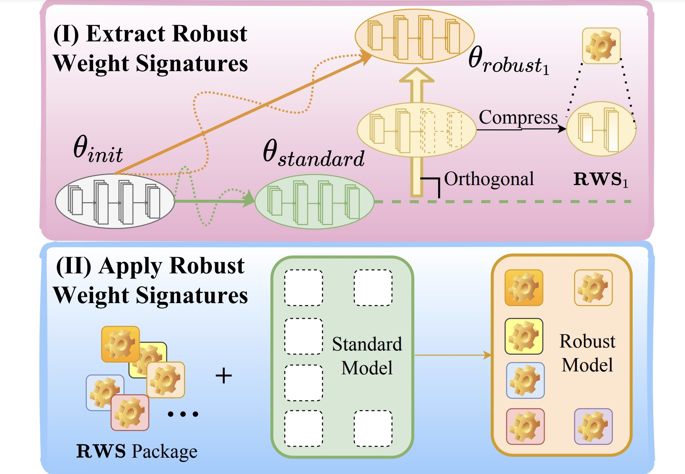

# Robust Weight Signatures
[](https://opensource.org/licenses/MIT)

The official implementation of paper [Robust Weight Signatures: Gaining Robustness as Easy as Patching Weights?](https://arxiv.org/abs/2302.12480) [ICML2023].

Ruisi Cai, Zhenyu Zhang, Zhangyang Wang

## Abstract
Given a robust model trained to be resilient to one or multiple types of distribution shifts (e.g., natural image corruptions), *how is that "robustness" encoded in the model weights, and how easily can it be disentangled and/or "zero-shot" transferred to some other models*? This paper empirically suggests a surprisingly simple answer: **linearly - by straightforward model weight arithmetic**! We start by drawing several key observations: (i) assuming that we train the same model architecture on both a clean dataset and its corrupted version, a comparison between the two resultant models shows their weights to mostly differ in shallow layers; (ii) the weight difference after projection, which we call *"Robust Weight Signature"* (**RWS**), appears to be discriminative and indicative of different corruption types; (iii) perhaps most strikingly, for the same corruption type, the RWSs obtained by one model architecture are highly consistent and transferable across different datasets. 

Based on those RWS observations, we propose a minimalistic model robustness "patching" framework that carries a model trained on clean data together with its pre-extracted RWSs. In this way, injecting certain robustness to the model is reduced to directly adding the corresponding RWS to its weight. We experimentally verify our proposed framework to be remarkably (1) **lightweight**. since RWSs concentrate on the shallowest few layers and we further show they can be painlessly quantized, storing an RWS is up to 13 x more compact than storing the full weight copy; (2) **in-situ adjustable**. RWSs can be appended as needed and later taken off to restore the intact clean model. We further demonstrate one can linearly re-scale the RWS to control the patched robustness strength; (3) **composable**. Multiple RWSs can be added simultaneously to patch more comprehensive robustness at once; and (4) **transferable**. Even when the clean model backbone is continually adapted or updated, RWSs remain as effective patches due to their outstanding cross-dataset transferability.



## Requirements
Requirements are provided in ``requirements.txt``.

## Model Training and Testing
Models preparation - standard models.
```
python train_corruption.py \
    --pretrained --lr 0.01 \
    --dataset <dataset> --arch <arch> \
    --data <training data> --std_data <standard data> \
    --pretrained_path <pre-trained model path> --save_dir <path for checkpoint>
```

Models preparation - robust models.
```
python train_corruption.py \
    --pretrained --lr 0.01 \
    --dataset <dataset> --arch <arch> --corruption <corruption type> \
    --data <training data> --std_data <standard data> \
    --pretrained_path <pre-trained model path> --save_dir <path for checkpoint>
```

RWS extraction and Model Patching.
```
python model_patching.py --keep_num <num of layers used> --dataset <dataset> --arch <arch> \
        --corruption <corruption type> --serverity <severity level> --data <std testing data> --corruption_data <corrupted testing data>
        --corruption_model_root <root to store all robust models> \
        --base_model <root to base model> --pretrained <root to pretrained model --save_log <path to save log>
```

## Citation
If you find this useful, please cite the following paper:
```
@article{cai2023robust,
  title={Robust Weight Signatures: Gaining Robustness as Easy as Patching Weights?},
  author={Cai, Ruisi and Zhang, Zhenyu and Wang, Zhangyang},
  journal={arXiv preprint arXiv:2302.12480},
  year={2023}
}
```